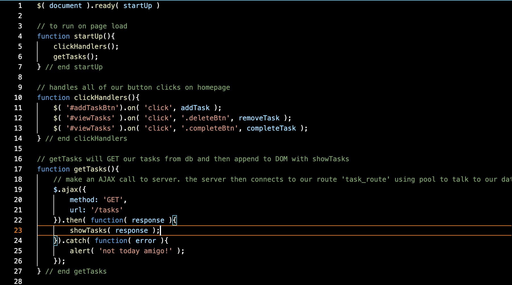
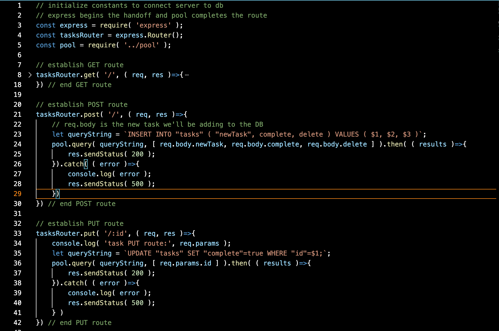

# To-Do List

## Description

Technologies used:

    - SQL
    - JQuery
    - Javascript
    - HTML
    - Node
    - Express

This is my first CRUD web app, and it's a to-do list. The user is able to see all tasks on list on the DOM,afdsa
they are able to add a task, delete a task, and mark an uncompleted task as done. 

The problem I solved was creating an easy to-do list to keep track of the daily things we need to accomplish
in any given day with easy access to add/delete/update as needed. 

This app uses JavaScript, JQuery, Express, Node JS, and PostgresSQL 

Additional README details can be found [here](https://github.com/PrimeAcademy/readme-template/blob/master/README.md).
